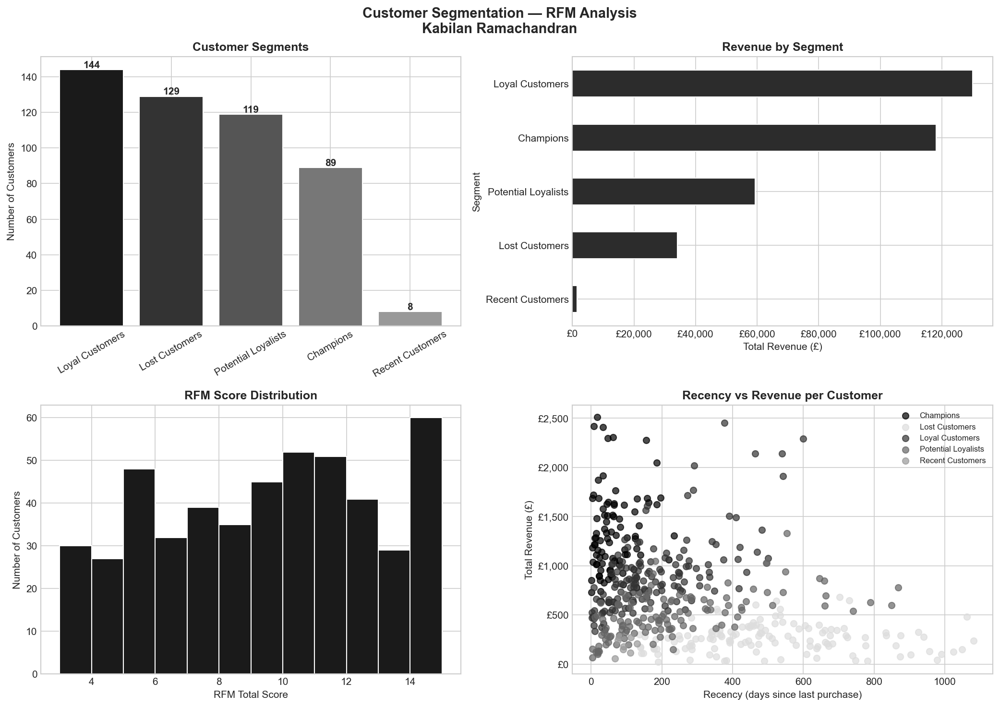

# Customer Segmentation — RFM Analysis

## Project Overview
RFM (Recency, Frequency, Monetary) customer segmentation 
of 489 customers across 2,000 transactions using Python — 
identifying Champions, Loyal Customers, and At-Risk segments.

## Tools & Skills
- Python — Pandas, NumPy, Matplotlib, Seaborn
- RFM Methodology — Recency, Frequency, Monetary scoring
- Customer Analytics — Behavioural segmentation
- Data Visualisation — 4-chart professional dashboard

## Key Business Insights
- 89 Champions (18.2%) generate highest revenue per customer
- 144 Loyal Customers = largest segment by count
- Champions avg spend significantly higher than Lost Customers
- Recency vs Revenue scatter shows clear Champions cluster
- 8 Recent Customers — new acquisition opportunity to nurture

## Dashboard

## Author
**Kabilan Ramachandran**  
linkedin.com/in/kabilan-ramachandran  
github.com/kabilanramachandran
